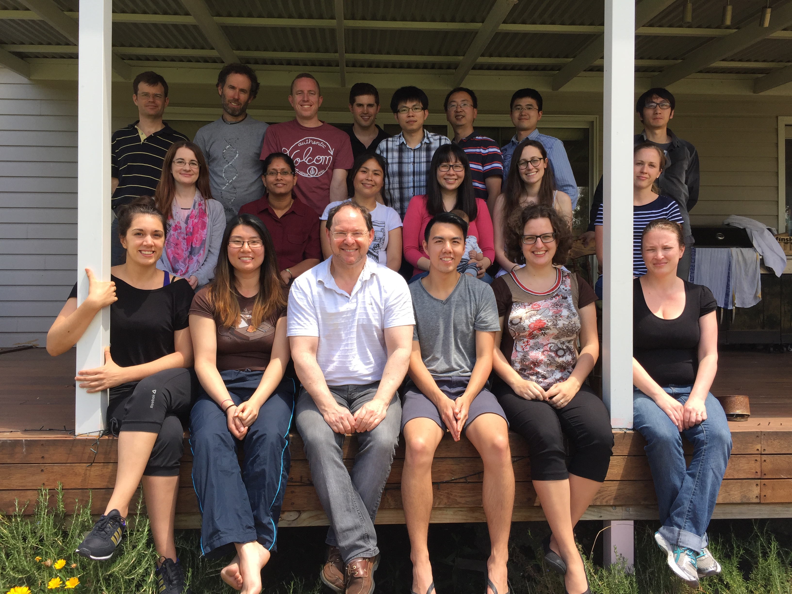



<figure>

<figcaption>Group Retreat 2015, Hunter Valley NSW</figcaption>
</figure>

***

### Gene and Stem Cell Therapy Program Head
- [Professor John Rasko, AO](./profiles/john)

### Senior Research Officers
- [Chuck Bailey](./profiles/chuck)
- [Justin Wong](./profiles/justin)

### Research Officers
- [Amy Au](./profiles/amyau)
- [Chau-To Kwok](./profiles/chauto)
- [Amy Marshall](./profiles/amymarshall)
- [Carl Power](./profiles/carlpower)
- [Ulf Schmitz](./profiles/ulf)
- [Darya Vanichkina](./profiles/darya)

### Graduate Students
- [Frank Jia](./profiles/frank) 
- [Liane Khoo](./profiles/liane)
- [Keren Weiss](./profiles/keren)

### Honours Students
- [Maninda Amarasekera](./profiles/maninda)

### Research Assistants
- [Yue (Julie) Feng](./profiles/juliefeng)
- [Cynthia Metierre](./profiles/cynthia)
- [Rajini Nagarajah](./profiles/rajini)
- [Patrick O'Young](./profiles/patrick)
- [Natalia Pinello](./profiles/natalia)
- [Melissa Vellozzi](./profiles/melissa)

### Affiliate Members
- [Angel Jaramillo](./profiles/angel)
- [Janet Macpherson](./profiles/janet)

***

### Former Lab Members

#### Origins of Cancer Laboratory

- [A/Prof Jeff Holst](./profiles/jeff) - Group Leader, Origins of Cancer Laboratory, University of Sydney Charles Perkins Centre
- [Kevin Wang](./profiles/kevin) - Research Officer, Origins of Cancer Laboratory, University of Sydney Charles Perkins Centre
- [Rae-Anne Hardie](./profiles/raeanne) - Research Officer, Origins of Cancer Laboratory, University of Sydney Charles Perkins Centre
- [Michelle van Geldermalsen](./profiles/michelle) - continuing PhD at the Origins of Cancer Laboratory, University of Sydney Charles Perkins Centre
- [Nick Otte](./profiles/nickotte) - continuing PhD at the Origins of Cancer Laboratory, University of Sydney Charles Perkins Centre
- [Blake Zhang](./profiles/blake) - continuing PhD at the Origins of Cancer Laboratory, University of Sydney Charles Perkins Centre
- [Abram Wassef](./profiles/abram) - continuing PhD at the Origins of Cancer Laboratory, University of Sydney Charles Perkins Centre

#### Senior Research Officers
- [Dr William Ritchie](./profiles/williamr) - ...

#### PhD Students
- [Dadi Gao](./profiles/dadi) - Harvard Medical School  
- [Fiona Guan](./profiles/fiona)

#### Research Assistants
- [Trung Viet Nguyen](./profiles/trung) - PhD student, [Lister Lab](http://listerlab.org/), University of Western Australia
